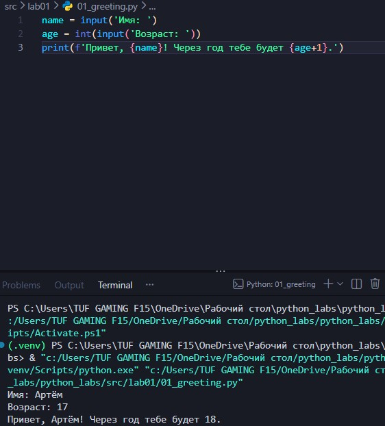
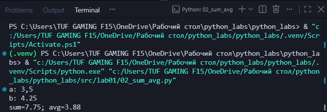
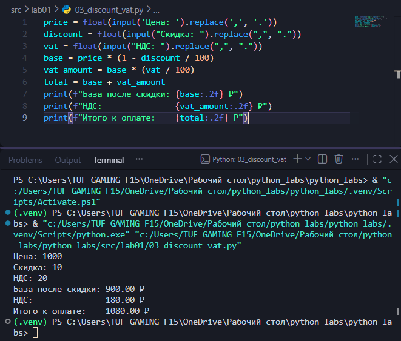
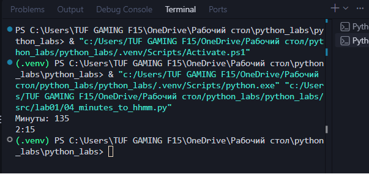
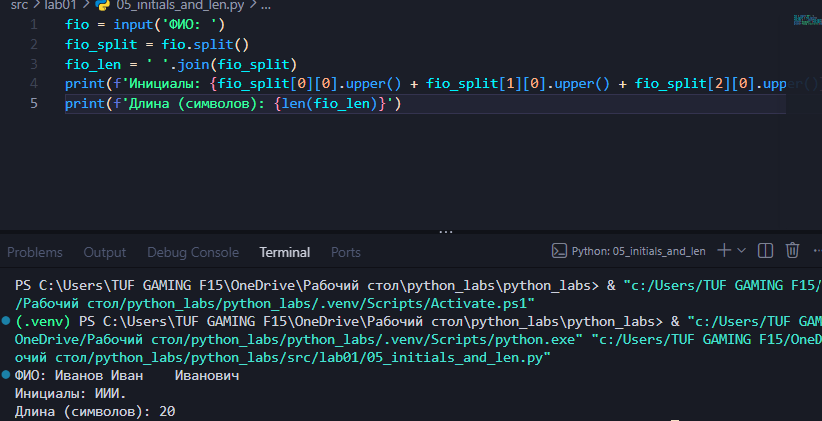
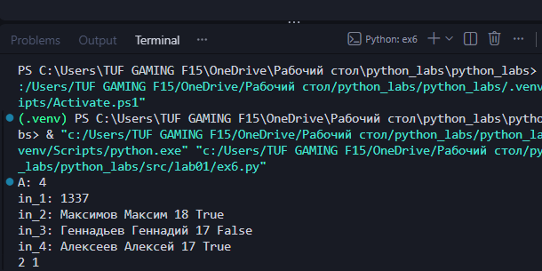

# ЛР1

## Задание 1
База, считываем имя и возраст, после чего выводим возраст через год

## Задание 2

Использовал реплейс, потом перевел в float, вывод с 2 знаками

## Задание 3

Расчеты по формулам сделаны, вывод с 2 знаками

## Задание 4

Разбил общее кол-во минут на часы+минуты, минуты вывожу из 2 цмфр

## Задание 5

Убираю лишние пробелы через split и join, затем взял первые буквы фио и посчитал длину очищенной строки

## Задание 6

Сделал проверку на 1337, чтобы не было ошибки с распаковкой, далее подсчет участников true или false

