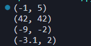
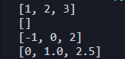
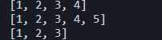
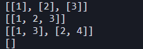
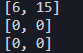
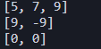
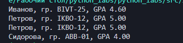

# Лабораторная работа №2

## Коллекции и матрицы

---

## Задание A

### min_max

Функция возвращает минимальный и максимальный элементы списка и есть проверка на пустое значение.

```python
def min_max(nums):
    if not nums:
        raise ValueError

    return min(nums), max(nums)
```



### unique_sorted

Функция удаляет повторяющиеся элементы и возвращает отсортированный список.

```python
def unique_sorted(nums):
    return sorted(set(nums))
```



### flatten

Образует список с списками/кортежами в один, есть проверка на тайп еррор.

```python
def flatten(mat: list[list | tuple]) -> list:
    res = []

    for x in mat:
        if type(x) != list and type(x) != tuple:
            raise TypeError

        for el in x:
            res.append(el)

    return res
```



---

## Задание B — matrix.py

### Функция transpose


Для рваной матрицы вызывается ValueError, а так она транспонирует функцию.

```python
def transpose(mat: list[list[float | int]]) -> list[list]:
    if not mat:
        return []

    for x in mat:
        if len(x) != len(mat[0]):
            raise ValueError

    res = []

    for j in range(len(mat[0])):
        newmat = []

        for i in range(len(mat)):
            newmat.append(mat[i][j])

        res.append(newmat)

    return res
```



### Функция row_sums

Функция находит список сумм элементов каждой строки матрицы.

```python
def row_sums(mat: list[list[float | int]]) -> list[float]:
    for st in mat:
        if len(st) != len(mat[0]):
            raise ValueError

    res = []

    for st in mat:
        res.append(sum(st))

    return res
```



### Функция col_sums

Функция считает список сумм каждого столбца.

```python
def col_sums(mat: list[list[float | int]]) -> list[float]:
    for x in mat:
        if len(x) != len(mat[0]):
            raise ValueError

    res = []

    for j in range(len(mat[0])):
        s = 0

        for i in range(len(mat)):
            s += mat[i][j]

        res.append(s)

    return res
```




---

## Задание C — tuples.py

### Функция format_record

Функция получает данные студента в виде фио, группы и гпа. Проверяет правильность введенных данных, убирает лишние пробелы в ФИО и делает из имени и отчества инициалы. GPA выводится с двумя знаками после точки.


```python
def format_record(rec: tuple[str, str, float]) -> str:
    fio, group, gpa = rec

    if not fio.strip() or not group.strip():
        raise ValueError

    if type(gpa) != float:
        raise TypeError

    part = fio.split()

    surnam = part[0].capitalize()

    init = ''

    for name in part[1:]:
        init += name[0].upper() + '.'

    group = group.strip()

    return f'{surnam} {init}, гр. {group}, GPA {gpa:.2f}'
```


